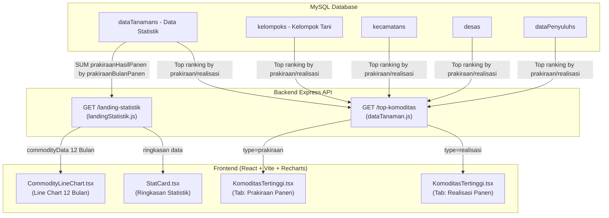

# Dokumentasi Arsitektur & Pengambilan Data Grafik dan Tabel di Homepage (Siketan)

Dokumen ini menjelaskan spesifikasi teknis, sumber data database, arsitektur endpoint backend, model agregasi, serta implementasi frontend untuk seluruh komponen visualisasi data pada halaman Beranda (*Homepage*) dan Halaman Data (*HomeDataPage*):

1. **Produksi Pertanian Berdasarkan Komoditas (Line Chart)**
2. **Data Produk Komoditas Tertinggi Berdasarkan Prakiraan Hasil Panen (Table)**
3. **Data Produk Komoditas Tertinggi Berdasarkan Realisasi Hasil Panen (Table)**

---

## 1. Arsitektur Umum & Aliran Data



---

## 2. Produksi Pertanian Berdasarkan Komoditas (Line Chart)

Grafik garis (*Line Chart*) interaktif yang memvisualisasikan volume prakiraan hasil panen seluruh komoditas pertanian di Kabupaten Ngawi per bulan (Januari s.d. Desember) dalam satu tahun tertentu.

### A. Spesifikasi Endpoint Backend

* **Method / URL**: `GET /landing-statistik`
* **Query Parameters**:
  | Parameter | Tipe Data | Deskripsi | Default |
  | :--- | :--- | :--- | :--- |
  | `tahun` | `number \| string` | Tahun data yang ingin diambil (misal `2026`). | Tahun berjalan (`new Date().getFullYear()`) |

#### Contoh Request:
```http
GET /landing-statistik?tahun=2026 HTTP/1.1
Host: api.siketan.ngawikab.go.id
```

### B. Sumber Data Database & Logika Query

* **Tabel Sumber**: `dataTanamans` (Model: `dataTanaman`)
* **Filter Database**:
  - `komoditas IS NOT NULL AND komoditas != ''`
  - `prakiraanBulanPanen IS NOT NULL AND prakiraanBulanPanen != '-'`
  - `createdAt BETWEEN 'YYYY-01-01 00:00:00' AND 'YYYY-12-31 23:59:59'`
* **Pengelompokan (Group By)**: `prakiraanBulanPanen`, `komoditas`
* **Agregasi Metrik**: `SUM(prakiraanHasilPanen) AS totalHasilPanen`
* **Penanganan Bulan Panen**:
  Nama bulan panen dinormalisasi ke dalam 12 indeks bulan standar (`Jan` s.d. `Des`):
  `Januari` $\rightarrow$ `Jan`, `Februari` $\rightarrow$ `Feb`, `Maret` $\rightarrow$ `Mar`, `April` $\rightarrow$ `Apr`, `Mei` $\rightarrow$ `Mei`, `Juni` $\rightarrow$ `Jun`, `Juli` $\rightarrow$ `Jul`, `Agustus` $\rightarrow$ `Agu`, `September` $\rightarrow$ `Sep`, `Oktober` $\rightarrow$ `Okt`, `November/Nopember` $\rightarrow$ `Nov`, `Desember` $\rightarrow$ `Des`.
* **Zero-Filling (Mencegah Grafik Terputus)**:
  Setiap komoditas yang terdaftar diinisialisasi dengan nilai `0` untuk seluruh 12 bulan sehingga payload tidak memiliki nilai `undefined` / `null`.

#### Contoh Response Backend:
```json
{
  "success": true,
  "message": "Data statistik landing page berhasil diambil",
  "data": {
    "ringkasan": {
      "jumlahPetani": 4520,
      "jumlahGapoktan": 217,
      "jumlahPenyuluh": 58,
      "areaPertanian": 128450.5,
      "jumlahKomoditas": 12
    },
    "commodityData": [
      {
        "month": "Jan",
        "commodities": {
          "padi_konvensional": 0,
          "padi_ramah_lingkungan": 0,
          "jagung": 0,
          "bawang_merah": 0
        }
      },
      {
        "month": "Mar",
        "commodities": {
          "padi_konvensional": 153545,
          "padi_ramah_lingkungan": 192571,
          "jagung": 144,
          "bawang_merah": 2851
        }
      }
    ]
  }
}
```

### C. Implementasi Frontend

* **File Komponen**:
  - [`CommodityLineChart.tsx`](file:///d:/Project/Real%20Project/Siketan/Production/siketan-production/frontend/src/features/Home/components/CommodityLineChart.tsx)
  - [`SectionDataPertanian.tsx`](file:///d:/Project/Real%20Project/Siketan/Production/siketan-production/frontend/src/features/Home/components/SectionDataPertanian.tsx)
  - [`HomeDataPage.tsx`](file:///d:/Project/Real%20Project/Siketan/Production/siketan-production/frontend/src/features/HomeData/page/HomeDataPage.tsx)
  - Helper Service: [`fetchKomoditasData.ts`](file:///d:/Project/Real%20Project/Siketan/Production/siketan-production/frontend/src/utils/fetchKomoditasData.ts)
* **Fitur Utama Visualisasi**:
  - **Multi-Select Chip**: Pengguna dapat memilih satu atau beberapa komoditas sekaligus untuk dibandingkan.
  - **Auto Active Filtering**: Chip hanya menampilkan komoditas yang memiliki data produksi pada tahun terpilih.
  - **Garis Tersambung (*Continuous Line*)**: Menggunakan properti `connectNulls={true}` pada Recharts `<Line />`.
  - **Formatted Tooltip & Axis**: Menampilkan satuan `kg / ton` dan singkatan angka ribuan/jutaan (`rb` / `jt`).

---

## 3. Data Produk Komoditas Tertinggi Berdasarkan Prakiraan Hasil Panen

Tabel publik yang menampilkan peringkat komoditas dengan estimasi volume panen tertinggi di Kabupaten Ngawi, mencakup data kelompok tani, lokasi desa/kecamatan, serta penyuluh pendamping.

### A. Spesifikasi Endpoint Backend

* **Method / URL**: `GET /top-komoditas`
* **Query Parameters**:
  | Parameter | Tipe Data | Deskripsi | Default |
  | :--- | :--- | :--- | :--- |
  | `type` | `string` | Jenis data: **`prakiraan`** | `prakiraan` |
  | `page` | `number` | Nomor halaman data | `1` |
  | `limit` | `number` | Jumlah baris per halaman | `5` |
  | `sortBy` | `string` | Kolom pengurutan (`prakiraanHasilPanen`, `prakiraanLuasPanen`, `komoditas`, dll.) | `prakiraanHasilPanen` |
  | `sortOrder` | `string` | Arah pengurutan: `DESC` atau `ASC` | `DESC` |

#### Contoh Request:
```http
GET /top-komoditas?type=prakiraan&page=1&limit=5&sortBy=prakiraanHasilPanen&sortOrder=DESC HTTP/1.1
Host: api.siketan.ngawikab.go.id
```

### B. Sumber Data Database & Relasi

* **Tabel Utama**: `dataTanamans`
* **Filter Waktu**: `createdAt >= NOW() - INTERVAL 90 DAY` (Data 90 hari terakhir)
* **Pengurutan Default**: `ORDER BY prakiraanHasilPanen DESC`
* **Relasi Tabel (Eager Loading)**:
  - `kelompok` $\rightarrow$ Informasi Kelompok Tani (`namaKelompok`, `gapoktan`)
  - `kelompok.kecamatanData` $\rightarrow$ Wilayah Kecamatan (`nama`)
  - `kelompok.desaData` $\rightarrow$ Wilayah Desa (`nama`)
  - `kelompok.dataPenyuluh` $\rightarrow$ Data Petugas Penyuluh Lapangan (`nama`, `nik`)

#### Contoh Response Backend:
```json
{
  "message": "Data berhasil didapatkan.",
  "data": [
    {
      "id": 15502,
      "kategori": "Pangan",
      "komoditas": "Padi Konvensional",
      "periodeTanam": "April",
      "prakiraanBulanPanen": "Juli",
      "prakiraanLuasPanen": 12,
      "prakiraanHasilPanen": 84,
      "kelompok": {
        "namaKelompok": "Tani Makmur 1",
        "gapoktan": "Maju Bersama",
        "kecamatanData": { "nama": "Geneng" },
        "desaData": { "nama": "Klampisan" },
        "dataPenyuluh": { "nama": "Budi Santoso, S.P." }
      }
    }
  ],
  "total": 1420,
  "currentPages": 1,
  "limit": 5,
  "maxPages": 284,
  "from": 1,
  "to": 5
}
```

### C. Kolom Tampilan Frontend

| Nama Kolom | Field Data | Keterangan |
| :--- | :--- | :--- |
| **No** | Auto-index | Nomor urut berdasar pagination `(page - 1) * limit + index + 1` |
| **Kategori Tanaman** | `kategori` | Kategori komoditas (Pangan, Hortikultura, Perkebunan) |
| **Komoditas** | `komoditas` | Jenis komoditas tanaman |
| **Bulan Tanam** | `periodeTanam` | Bulan mulai tanam |
| **Prakiraan Bulan Panen**| `prakiraanBulanPanen` | Estimasi bulan panen |
| **Prakiraan Luas Panen** | `prakiraanLuasPanen` | Luas lahan panen (Ha) |
| **Prakiraan Hasil Panen**| `prakiraanHasilPanen` | Estimasi volume panen (Ton/Kuintal) |
| **Kelompok Tani** | `kelompok.namaKelompok` & `gapoktan` | Nama poktan dan gapoktan pengelola |
| **Penyuluh** | `kelompok.dataPenyuluh.nama` | Nama penyuluh binaan |
| **Lokasi** | `kelompok.desaData.nama`, `kecamatanData.nama` | Lokasi administratif |

---

## 4. Data Produk Komoditas Tertinggi Berdasarkan Realisasi Hasil Panen

Tabel yang menampilkan komoditas dengan realisasi hasil panen aktual tertinggi yang telah diverifikasi dan dicatatkan ke dalam sistem.

### A. Spesifikasi Endpoint Backend

* **Method / URL**: `GET /top-komoditas`
* **Query Parameters**:
  | Parameter | Tipe Data | Deskripsi | Default |
  | :--- | :--- | :--- | :--- |
  | `type` | `string` | Jenis data: **`realisasi`** | - |
  | `page` | `number` | Nomor halaman data | `1` |
  | `limit` | `number` | Jumlah baris per halaman | `5` |
  | `sortBy` | `string` | Kolom pengurutan (`realisasiHasilPanen`, `realisasiLuasPanen`, dll.) | `realisasiHasilPanen` |
  | `sortOrder` | `string` | Arah pengurutan: `DESC` atau `ASC` | `DESC` |

#### Contoh Request:
```http
GET /top-komoditas?type=realisasi&page=1&limit=5&sortBy=realisasiHasilPanen&sortOrder=DESC HTTP/1.1
Host: api.siketan.ngawikab.go.id
```

### B. Sumber Data Database & Relasi

* **Tabel Utama**: `dataTanamans`
* **Pengurutan Default**: `ORDER BY realisasiHasilPanen DESC`
* **Relasi Tabel (Eager Loading)**: Sama seperti prakiraan panen (`kelompok`, `kecamatanData`, `desaData`, `dataPenyuluh`).

#### Contoh Response Backend:
```json
{
  "message": "Data berhasil didapatkan.",
  "data": [
    {
      "id": 15490,
      "kategori": "Pangan",
      "komoditas": "Padi Ramah Lingkungan",
      "periodeTanam": "Februari",
      "realisasiBulanPanen": "Mei",
      "realisasiLuasPanen": 15,
      "realisasiHasilPanen": 105,
      "kelompok": {
        "namaKelompok": "Sumber Rejeki",
        "gapoktan": "Tani Sejahtera",
        "kecamatanData": { "nama": "Ngawi" },
        "desaData": { "nama": "Karangtengah" },
        "dataPenyuluh": { "nama": "Siti Aminah, S.P." }
      }
    }
  ],
  "total": 980,
  "currentPages": 1,
  "limit": 5,
  "maxPages": 196,
  "from": 1,
  "to": 5
}
```

### C. Kolom Tampilan Frontend

| Nama Kolom | Field Data | Keterangan |
| :--- | :--- | :--- |
| **No** | Auto-index | Nomor urut baris |
| **Kategori Tanaman** | `kategori` | Kategori komoditas |
| **Komoditas** | `komoditas` | Nama komoditas |
| **Bulan Tanam** | `periodeTanam` | Bulan mulai tanam |
| **Realisasi Bulan Panen**| `realisasiBulanPanen` | Bulan panen aktual |
| **Realisasi Luas Panen** | `realisasiLuasPanen` | Luas lahan terealisasi (Ha) |
| **Realisasi Hasil Panen**| `realisasiHasilPanen` | Volume hasil panen aktual (Ton/Kuintal) |
| **Kelompok Tani** | `kelompok.namaKelompok` & `gapoktan` | Nama poktan / gapoktan |
| **Penyuluh** | `kelompok.dataPenyuluh.nama` | Nama penyuluh pendamping |
| **Lokasi** | `kelompok.desaData.nama`, `kecamatanData.nama` | Desa & Kecamatan |

---

## 5. Ringkasan File & Komponen Terkait

| Komponen / File | Layer | Peran & Fungsi |
| :--- | :--- | :--- |
| [`landingStatistik.js`](file:///d:/Project/Real%20Project/Siketan/Production/siketan-production/backend/app/controllers/landingStatistik.js) | Backend Controller | Agregasi data 12 bulan dari `dataTanamans` berdasarkan `prakiraanBulanPanen` dan `SUM(prakiraanHasilPanen)` |
| [`dataTanaman.js`](file:///d:/Project/Real%20Project/Siketan/Production/siketan-production/backend/app/controllers/dataTanaman.js) | Backend Controller | Menyediakan endpoint `getTopKomoditasTanaman` untuk data prakiraan dan realisasi komoditas tertinggi |
| [`fetchKomoditasData.ts`](file:///d:/Project/Real%20Project/Siketan/Production/siketan-production/frontend/src/utils/fetchKomoditasData.ts) | Frontend Service | Fetcher API tahunan ke `/landing-statistik` & formatter komoditas |
| [`useKomoditasTertinggi.ts`](file:///d:/Project/Real%20Project/Siketan/Production/siketan-production/frontend/src/hook/useKomoditasTertinggi.ts) | Frontend Hook | React Query hook untuk memanggil `/top-komoditas` dengan pagination dan sorting |
| [`CommodityLineChart.tsx`](file:///d:/Project/Real%20Project/Siketan/Production/siketan-production/frontend/src/features/Home/components/CommodityLineChart.tsx) | Frontend Component | Komponen visualisasi Recharts Line Chart |
| [`KomoditasTertinggi.tsx`](file:///d:/Project/Real%20Project/Siketan/Production/siketan-production/frontend/src/features/Home/components/KomoditasTertinggi.tsx) | Frontend Component | Komponen tab tabel (Prakiraan vs Realisasi Panen) |
| [`SectionDataPertanian.tsx`](file:///d:/Project/Real%20Project/Siketan/Production/siketan-production/frontend/src/features/Home/components/SectionDataPertanian.tsx) | Frontend Feature | Section statistik dan chart di halaman Homepage (`/`) |
| [`HomeDataPage.tsx`](file:///d:/Project/Real%20Project/Siketan/Production/siketan-production/frontend/src/features/HomeData/page/HomeDataPage.tsx) | Frontend Page | Halaman utama Data Pertanian publik (`/home/data`) |
