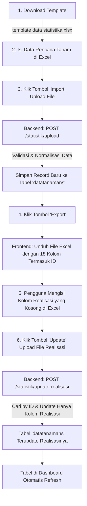

# System Design: Alur Import, Export, dan Bulk Update Realisasi Data Statistika Pertanian

Dokumen ini menjelaskan rancangan sistem, arsitektur, alur kerja (*end-to-end workflow*), spesifikasi kolom berkas Excel, aturan normalisasi data, API endpoint, serta panduan antarmuka untuk fitur **Import Data Tanaman**, **Export Data Lengkap**, dan **Bulk Update Realisasi** pada modul Statistika Pertanian platform **Siketan**.

---

## 1. Latar Belakang & Tujuan

Pengelolaan data komoditas dan hasil panen pertanian melibatkan volume data yang cukup besar dari banyak Kelompok Tani (Poktan). Penginputan dan pembaruan data satu per satu melalui formulir web memakan waktu.

Sistem ini dirancang untuk menyediakan alur kerja berbasis *spreadsheet* (Excel `.xlsx`/`.xls`) yang terintegrasi:
1. **Import (Bulk Create):** Memasukkan data rencana tanam dan prakiraan panen secara massal menggunakan berkas template baku.
2. **Export (Complete Data Dump):** Mengunduh seluruh data tanaman yang tersimpan lengkap dengan identitas unik (`ID`), data kelompok tani, data tanam, prakiraan panen, dan kolom realisasi.
3. **Pengisian Realisasi Offline:** Pengguna mengisi data hasil panen aktual (realisasi) langsung pada file Excel hasil export.
4. **Bulk Update Realisasi:** Mengunggah kembali berkas yang telah diperbarui untuk memperbarui data realisasi berdasarkan `ID` record tanpa mengubah data pokok lainnya.

---

## 2. Diagram Alur Kerja (*End-to-End Workflow*)



---

## 3. Spesifikasi Alur 1: Import Data Tanaman (Bulk Creation)

### A. Format & Berkas Template
* **Nama Berkas Template:** `template data statistika.xlsx` (tersimpan di `@/assets/template/template data statistika.xlsx`).
* **Format yang Didukung:** `.xlsx`, `.xls`, `.csv` (Maksimal 10 MB).
* **Target Pembacaan:** Sheet pertama (*Sheet 1* / *Worksheet* ke-1).
* **Baris Data:** Pembacaan data dimulai dari baris ke-2 (baris ke-1 dianggap sebagai judul kolom/header).

### B. Struktur Kolom Template (8 Kolom)

| No Kolom | Nama Kolom di Excel | Field Database | Tipe Data | Keterangan & Validasi |
| :--- | :--- | :--- | :--- | :--- |
| **1** | `ID Poktan` | `fk_kelompokId` | Integer / Foreign Key | Wajib diisi. Harus terdaftar pada tabel `kelompoks`. |
| **2** | `Kategori ` | `kategori` | ENUM / String | Wajib diisi. Otomatis dikonversi ke **huruf kecil (*lowercase*)**. Nilai valid: `pangan`, `perkebunan`, `sayur`, `buah`. |
| **3** | `Komoditas ` | `komoditas` | String | Wajib diisi. Otomatis dikonversi ke **Title Case** (Contoh: `Padi Ramah Lingkungan`). |
| **4** | `Periode Tanam (Bulan)` | `periodeTanam` | String | Wajib diisi. Nama bulan valid (`Januari` s/d `Desember`). |
| **5** | `Luas Lahan Tanam (Ha)` | `luasLahan` | Float / Decimal | Wajib diisi. Angka numerik desimal $> 0$. |
| **6** | `Prakiraan Luas Panen (Ha)` | `prakiraanLuasPanen` | Float / Decimal | Wajib diisi. Angka numerik desimal $> 0$. |
| **7** | `Prakiraan Hasil Panen (Ton)` | `prakiraanHasilPanen` | Float / Decimal | Wajib diisi. Angka numerik desimal $> 0$. |
| **8** | `Prakiraan Bulan Panen` | `prakiraanBulanPanen` | String | Opsional. Jika diisi, harus berupa nama bulan valid (`Januari` s/d `Desember`). |

### C. Aturan Normalisasi Data
1. **Kategori:**
   ```javascript
   if (typeof kategori === 'string') {
     kategori = kategori.toLowerCase().trim();
     if (kategori === 'jenis_sayur') kategori = 'sayur';
   }
   ```
2. **Komoditas & Bulan:**
   ```javascript
   const toTitleCase = (str) => {
     if (!str || typeof str !== 'string') return str;
     return str
       .toLowerCase()
       .split(' ')
       .map(word => word.charAt(0).toUpperCase() + word.slice(1))
       .join(' ');
   };
   ```

---

## 4. Spesifikasi Alur 2: Export Data Lengkap

Saat pengguna menekan tombol **`Export`** pada tabel data statistika, sistem mengekspor data yang difilter ke dalam file `.xlsx`. File ini menyertakan kolom `ID` record data agar dapat digunakan kembali untuk proses *bulk update*.

### Struktur 18 Kolom Hasil Export

| No Kolom | Header Kolom di File Excel | Sumber Data | Keterangan |
| :--- | :--- | :--- | :--- |
| **1** | `ID` | `item.id` | **Primary Key** record `datatanamans` (Kunci pencocokan update). |
| **2** | `ID Poktan` | `item.kelompok.id` / `fk_kelompokId` | ID Kelompok Tani. |
| **3** | `Nama Poktan` | `item.kelompok.namaKelompok` | Nama Kelompok Tani binaan. |
| **4** | `Gapoktan` | `item.kelompok.gapoktan` | Nama Gabungan Kelompok Tani. |
| **5** | `Kecamatan` | `item.kelompok.kecamatan` | Nama Kecamatan. |
| **6** | `Desa` | `item.kelompok.desa` | Nama Desa wilayah binaan. |
| **7** | `Kategori` | `item.kategori` | Kategori komoditas (`pangan`, `perkebunan`, `sayur`, `buah`). |
| **8** | `Komoditas` | `item.komoditas` | Nama varietas/komoditas tanaman. |
| **9** | `Periode Tanam (Bulan)` | `item.periodeTanam` | Bulan dimulainya penanaman. |
| **10** | `Luas Lahan Tanam (Ha)` | `item.luasLahan` | Luas lahan yang ditanami (Hektar). |
| **11** | `Prakiraan Luas Panen (Ha)` | `item.prakiraanLuasPanen` | Estimasi luas panen (Hektar). |
| **12** | `Prakiraan Hasil Panen (Ton)` | `item.prakiraanHasilPanen` | Estimasi berat panen (Ton). |
| **13** | `Prakiraan Bulan Panen` | `item.prakiraanBulanPanen` | Estimasi bulan panen. |
| **14** | `Realisasi Luas Panen (Ha)` | `item.realisasiLuasPanen` | Luas aktual panen *(Bisa kosong/terisi)*. |
| **15** | `Realisasi Hasil Panen (Ton)` | `item.realisasiHasilPanen` | Hasil aktual panen *(Bisa kosong/terisi)*. |
| **16** | `Realisasi Bulan Panen` | `item.realisasiBulanPanen` | Bulan aktual panen *(Bisa kosong/terisi)*. |
| **17** | `Created At` | `item.createdAt` | Tanggal dan waktu data dibuat (Format lokal `id-ID`). |
| **18** | `Updated At` | `item.updatedAt` | Tanggal dan waktu terakhir diubah (Format lokal `id-ID`). |

*(Catatan: Kolom `deletedAt` tidak disertakan).*

---

## 5. Spesifikasi Alur 3: Pengisian Realisasi oleh Pengguna

Setelah file Excel hasil export diunduh:
1. Pengguna membuka file di aplikasi spreadsheet (Microsoft Excel / Google Sheets / LibreOffice Calc).
2. Pengguna mencari baris tanaman yang telah selesai masa panennya.
3. Pengguna mengisi nilai pada 3 kolom realisasi:
   - **`Realisasi Luas Panen (Ha)`**: Contoh `15.5`
   - **`Realisasi Hasil Panen (Ton)`**: Contoh `82.0`
   - **`Realisasi Bulan Panen`**: Contoh `Agustus`
4. Pengguna **tidak boleh mengubah atau menghapus nilai kolom `ID`** pada kolom pertama.
5. Pengguna menyimpan file (`.xlsx`, `.xls`, atau `.csv`).

---

## 6. Spesifikasi Alur 4: Bulk Update Realisasi (Tombol "Update")

### A. Mekanisme Pembaruan Data di Backend
1. File Excel diunggah melalui tombol **`Update`**.
2. Backend membaca Sheet ke-1 dan mencari indeks kolom:
   - Kolom `ID` (mendeteksi kata kunci: `id`, `no id`, `id data`).
   - Kolom `Realisasi Luas Panen`.
   - Kolom `Realisasi Hasil Panen`.
   - Kolom `Realisasi Bulan Panen`.
3. Backend melakukan perulangan baris:
   - Mencari record dengan `dataTanaman.findByPk(recordId)`.
   - Jika ditemukan, sistem menyusun objek pembaruan:
     ```javascript
     const updateData = {};
     if (validNumeric(rawLuas)) updateData.realisasiLuasPanen = numLuas;
     if (validNumeric(rawHasil)) updateData.realisasiHasilPanen = numHasil;
     if (validMonth(rawBulan)) updateData.realisasiBulanPanen = titleBulan;
     ```
   - Mengeksekusi `item.update(updateData)`.
4. **Isolasi Kolom Non-Realisasi:** Seluruh kolom lain seperti Kategori, Komoditas, Luas Lahan Tanam, dan data Kelompok Tani **diabaikan** oleh backend untuk mencegah modifikasi data pokok yang tidak disengaja.
5. Mencatat aktivitas audit: `postActivity({ activity: 'UPDATE_REALISASI_BULK', type: 'DATA TANAMAN' })`.
6. Mengembalikan respon jumlah baris yang berhasil diperbarui.

---

## 7. Spesifikasi API Endpoint

### 1. Upload / Import Data Tanaman
* **Method & URL:** `POST /statistik/upload`
* **Auth:** Bearer Token (`auth`, `hasPermission(PERMISSIONS.STATISTIC_CREATE)`)
* **Content-Type:** `multipart/form-data`
* **Payload:** `file` (File binary `.xlsx` / `.xls` / `.csv`)
* **Response (201 Created):**
  ```json
  {
    "message": "25 data berhasil diimport."
  }
  ```

---

### 2. Export Data Statistika
* **Method & URL:** `GET /statistik?isExport=true&tahun=2026&kategori=pangan`
* **Auth:** Bearer Token (`auth`, `hasPermission(PERMISSIONS.STATISTIC_INDEX)`)
* **Response (200 OK):**
  ```json
  {
    "message": "Data berhasil didapatkan.",
    "data": {
      "data": [
        {
          "id": 101,
          "fk_kelompokId": 12,
          "kategori": "pangan",
          "komoditas": "Padi Ramah Lingkungan",
          "periodeTanam": "Maret",
          "luasLahan": 10.5,
          "prakiraanLuasPanen": 10.0,
          "prakiraanHasilPanen": 55.0,
          "prakiraanBulanPanen": "Juli",
          "realisasiLuasPanen": null,
          "realisasiHasilPanen": null,
          "realisasiBulanPanen": null,
          "createdAt": "2026-03-01T08:00:00.000Z",
          "updatedAt": "2026-03-01T08:00:00.000Z",
          "kelompok": {
            "id": 12,
            "namaKelompok": "Tani Makmur",
            "gapoktan": "Gapoktan Sejahtera",
            "kecamatan": "Kepanjen",
            "desa": "Talangagung"
          }
        }
      ]
    }
  }
  ```

---

### 3. Bulk Update Realisasi
* **Method & URL:** `POST /statistik/update-realisasi`
* **Auth:** Bearer Token (`auth`, `hasPermission(PERMISSIONS.STATISTIC_EDIT)`)
* **Content-Type:** `multipart/form-data`
* **Payload:** `file` (File binary `.xlsx` / `.xls` / `.csv`)
* **Response (200 OK):**
  ```json
  {
    "message": "15 data realisasi berhasil diperbarui.",
    "updatedCount": 15
  }
  ```

---

## 8. Panduan Antarmuka (UI/UX Action Buttons & Role Access)

Tombol aksi pada header tabel `DashboardStatistika.tsx` dirancang dengan palet warna lembut (*soft pastel*), ikon representatif, dan pembatasan hak akses peran:

| Tombol | Ikon | Warna Background | Warna Teks / Ikon | Akses Peran | Aksi / Handler |
| :--- | :--- | :--- | :--- | :--- | :--- |
| **`+ Tambah`** | `FaPlus` | `bg-[#E8F0FE]` *(Soft Blue)* | `text-[#1A73E8]` | **Semua (Penyuluh, Operator, Super Admin)** | Navigasi ke halaman create form `/dashboard-admin/statistik-pertanian/create` |
| **`Template`** | `TbTablePlus` | `bg-[#F3E8FF]` *(Soft Purple)* | `text-[#7E22CE]` | **Hanya Non-Penyuluh** (Operator / Super Admin) | Mengunduh berkas `template data statistika.xlsx` |
| **`Import`** | `BsFiletypeXlsx` | `bg-[#FEF3C7]` *(Soft Amber)* | `text-[#B45309]` | **Hanya Non-Penyuluh** (Operator / Super Admin) | Membuka file picker untuk unggah data baru |
| **`Update`** | `TbTableOptions` | `bg-[#FEE2E2]` *(Soft Pink)* | `text-[#DC2626]` | **Hanya Non-Penyuluh** (Operator / Super Admin) | Membuka file picker untuk unggah file pembaruan realisasi |
| **`Export`** | `TbTableExport` | `bg-[#DCFCE7]` *(Soft Mint)* | `text-[#15803D]` | **Semua (Penyuluh, Operator, Super Admin)** | Membuka modal filter dan mengunduh berkas export |

> [!NOTE]
> Khusus untuk peran **Penyuluh**, sistem hanya menampilkan tombol **`+ Tambah`** dan **`Export`** di header tabel. Tombol `Template`, `Import`, dan `Update` disembunyikan secara otomatis.
