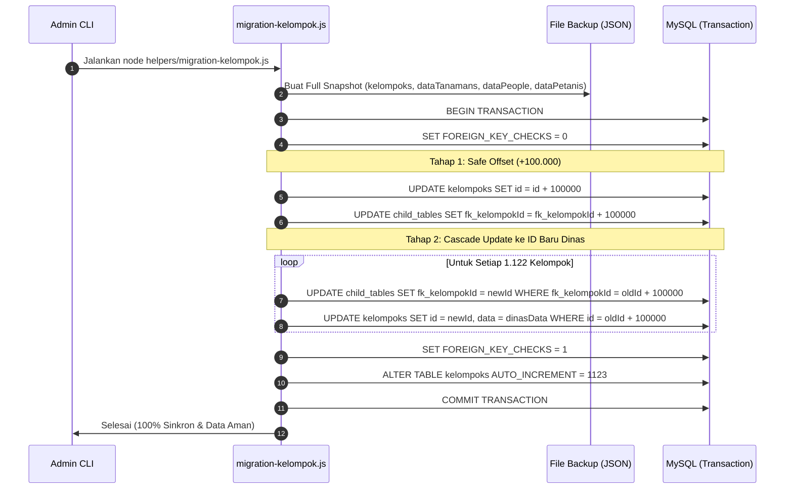

# Dokumentasi Sistem: Migrasi & Penyelarasan ID Kelompok Tani (Siketan)

Dokumentasi ini menjelaskan latar belakang masalah ketidaksesuaian ID Poktan, analisis data, arsitektur teknis re-indexing database, serta panduan operasional eksekusi migrasi dan prosedur pemulihan (*rollback/restore*).

---

## 1. Latar Belakang Masalah

### 1.1 Temuan Masalah (User / Dinas Report)
Berdasarkan laporan dari Dinas Pertanian Kabupaten Ngawi, terdapat ketidaksesuaian nomor Poktan pada aplikasi Siketan (misalnya pada halaman **Statistika Pertanian** dan **Laporan Tanam**) dibandingkan dengan daftar resmi penomoran kelompok tani dari Dinas ([List ID Poktan.xlsx](file:///d:/Project/Real%20Project/Siketan/Production/siketan-production/List%20ID%20Poktan.xlsx)).

#### Contoh Kasus Nyata:
- **Di Aplikasi Siketan (Existing):**
  - Kelompok: **`Mulyaning Bebrayan.`** (Gapoktan: *Gandri Makmur*, Desa: *Gandri*, Kec: *Pangkur*)
  - Terdaftar dengan: **`NO. POKTAN: 368`**
- **Di Daftar Resmi Dinas (`List ID Poktan.xlsx`):**
  - Kelompok **`Mulyaning Bebrayan.`** memiliki nomor resmi: **`409`**
  - Nomor **`368`** adalah milik kelompok **`Turi Margo`** (Gapoktan: *Tani Mulyo*, Desa: *Karangsono*, Kec: *Kwadungan*)

### 1.2 Akar Masalah (Root Cause)
Pada saat *seeding* awal database Siketan pada tahun 2023, urutan kelompok tani di-insert dengan urutan kecamatan yang berbeda dari urutan pengelompokan resmi Dinas Pertanian. Akibatnya:
1. Primary key `id` pada tabel `kelompoks` tidak merepresentasikan ID Poktan resmi Dinas.
2. Ketika data tanaman diinput ke tabel `dataTanamans`, foreign key `fk_kelompokId` mengikat ke ID lama database tersebut.

---

## 2. Hasil Audit Data (Database Siketan vs Excel Dinas)

Dari total **1.122 Kelompok Tani**:
- **339 Kelompok (30.2%):** Memiliki ID yang kebetulan sama/tetap antara DB dan Dinas (Kecamatan Sine s.d. Geneng).
- **783 Kelompok (69.8%):** Mengalami pergeseran/pertukaran nomor ID mulai dari Kecamatan Gerih ke bawah.
- **Tingkat Kecocokan Identitas:** **100% (1.122 / 1.122)** dapat dipetakan secara *bijective* (1-to-1) tanpa ada data yang hilang atau tidak terpetakan (`0 unmapped`).

### Rekapitulasi Per Kecamatan
| No | Kecamatan | Total Poktan | ID Sama (Tetap) | ID Bergeser (Tertukar) | Status |
| :-: | :--- | :-: | :-: | :-: | :--- |
| 1 | Sine | 63 | 63 | 0 | Sesuai |
| 2 | Ngrambe | 71 | 71 | 0 | Sesuai |
| 3 | Jogorogo | 44 | 44 | 0 | Sesuai |
| 4 | Kendal | 71 | 71 | 0 | Sesuai |
| 5 | Geneng | 75 | 75 | 0 | Sesuai |
| 6 | Gerih | 35 | 15 | 20 | Mulai Bergeser di ID 325 |
| 7 | Kwadungan | 48 | 0 | 48 | Bergeser Penuh |
| 8 | Pangkur *(Mulyaning Bebrayan)* | 40 | 0 | 40 | Bergeser Penuh (ID 368 $\to$ 409) |
| 9 | Karangjati | 70 | 0 | 70 | Bergeser Penuh |
| 10 | Bringin | 52 | 0 | 52 | Bergeser Penuh |
| 11 | Padas | 55 | 0 | 55 | Bergeser Penuh |
| 12 | Kasreman | 42 | 0 | 42 | Bergeser Penuh |
| 13 | Ngawi | 73 | 0 | 73 | Bergeser Penuh |
| 14 | Paron | 78 | 0 | 78 | Bergeser Penuh |
| 15 | Kedunggalar | 101 | 0 | 101 | Bergeser Penuh |
| 16 | Pitu | 46 | 0 | 46 | Bergeser Penuh |
| 17 | Widodaren | 65 | 0 | 65 | Bergeser Penuh |
| 18 | Mantingan | 53 | 0 | 53 | Bergeser Penuh |
| 19 | Karanganyar | 40 | 0 | 40 | Bergeser Penuh |
| **Total** | **19 Kecamatan** | **1.122** | **339** | **783** | **100% Terpetakan** |

> Laporan rinci baris demi baris tersedia di file: [Audit_Perubahan_ID_Poktan.xlsx](file:///d:/Project/Real%20Project/Siketan/Production/siketan-production/Audit_Perubahan_ID_Poktan.xlsx)

---

## 3. Analisis Risiko & Strategi Solusi

### 3.1 Mengapa Update Naif Sangat Berbahaya?
Jika tabel `kelompoks` di-update atau ditimpa langsung berdasarkan ID:
- Baris `id: 409` diubah namanya menjadi *Mulyaning Bebrayan*.
- Baris `id: 368` diubah namanya menjadi *Turi Margo*.
- **Akibat:** **12.170 data tanaman** di tabel `dataTanamans` yang sebelumnya terhubung ke `fk_kelompokId: 368` tiba-tiba akan tampil sebagai milik *Turi Margo*! Data hasil panen padi, luas lahan, dan realisasi komoditas akan **tertukar antarkelompok**.

### 3.2 Masalah Benturan Primary Key (Permutasi Swap)
Karena 783 ID saling bertukar (ID 368 $\to$ 409, ID 1110 $\to$ 368, dst), eksekusi `UPDATE kelompoks SET id = 409 WHERE id = 368` secara langsung akan memicu error:
`ER_DUP_ENTRY: Duplicate entry '409' for key 'PRIMARY'` karena ID 409 sudah ada sebelum dipindahkan.

### 3.3 Arsitektur Solusi: *Two-Phase Safe Re-indexing with Temporary Offset*



---

## 4. Tabel Terdampak dalam Sinkronisasi

| Nama Tabel | Kolom Foreign Key | Jumlah Data Terdampak | Tindakan Sinkronisasi |
| :--- | :--- | :-: | :--- |
| **`kelompoks`** | `id` (Primary Key) | 1.122 baris | ID diubah sesuai nomor resmi Dinas; nama, desa, kecamatan diselaraskan. |
| **`dataTanamans`** | `fk_kelompokId` | 12.170 baris | Nilai `fk_kelompokId` dipindahkan dari ID lama $\to$ ID baru sehingga data komoditas tetap melekat ke kelompok pemilik aslinya. |
| **`dataPeople`** | `kelompokId` | 2.123 baris | Nilai `kelompokId` dipindahkan dari ID lama $\to$ ID baru. |
| **`dataPetanis`** | `fk_kelompokId` | 30 baris | Nilai `fk_kelompokId` dipindahkan dari ID lama $\to$ ID baru. |
| **`dataOperators`** | *-* | 0 baris | Tidak terikat foreign key `kelompokId`. |

---

## 5. Panduan Operasional (Runbook)

File pendukung migrasi terletak di direktori `backend/helpers/`:
- **Script Migrasi:** [migration-kelompok.js](file:///d:/Project/Real%20Project/Siketan/Production/siketan-production/backend/helpers/migration-kelompok.js)
- **Script Restore/Rollback:** [restore-kelompok.js](file:///d:/Project/Real%20Project/Siketan/Production/siketan-production/backend/helpers/restore-kelompok.js)

### Langkah 1: Simulasi / Uji Coba (*Dry-Run*)
Menjalankan simulasi pencocokan data tanpa mengubah isi database apa pun:
```bash
cd backend
node helpers/migration-kelompok.js --dry-run
```
*Output yang diharapkan:* `Berhasil dipetakan: 1122 / 1122`, `Belum terpetakan: 0`.

### Langkah 2: Eksekusi Migrasi Penuh
Menjalankan migrasi database sebenarnya (otomatis mem-backup data terlebih dahulu):
```bash
cd backend
node helpers/migration-kelompok.js
# atau:
npm run migrate:poktan
```
*Waktu eksekusi:* ± 3 - 5 detik.

### Langkah 3: Verifikasi Pasca-Migrasi
Setelah proses selesai, buka antarmuka aplikasi Siketan:
1. Buka menu **Dashboard Admin > Statistik Pertanian**.
2. Cari kelompok **`Mulyaning Bebrayan.`**.
3. Pastikan kolom **No. Poktan** menampilkan angka **`409`**.
4. Pastikan data komoditas (Padi Konvensional, dsb.) tetap lengkap dan tidak berkurang.

---

## 6. Prosedur Pemulihan Darurat (*Rollback / Restore*)

Jika setelah migrasi dijalankan ditemukan kejanggalan atau perlu dikembalikan ke kondisi lama:

```bash
cd backend
node helpers/restore-kelompok.js
# atau:
npm run restore:poktan
```

### Mekanisme Restore:
1. Script mencari file backup terbaru di direktori `backend/backups/`.
2. Menghapus tabel `kelompoks` baru dan memasukkan kembali data lama asli.
3. Mengembalikan seluruh `fk_kelompokId` pada `dataTanamans`, `dataPeople`, dan `dataPetanis` ke ID lama menggunakan query batch super cepat (< 1 detik).
4. Database kembali 100% ke kondisi sebelum migrasi dijalankan.

---

## 7. Lokasi File & Aset Terkait

- **Data Sumber Dinas:** [List ID Poktan.xlsx](file:///d:/Project/Real%20Project/Siketan/Production/siketan-production/List%20ID%20Poktan.xlsx)
- **Laporan Audit Perubahan:** [Audit_Perubahan_ID_Poktan.xlsx](file:///d:/Project/Real%20Project/Siketan/Production/siketan-production/Audit_Perubahan_ID_Poktan.xlsx)
- **Folder Backup Otomatis:** `backend/backups/`
- **Script Migrasi:** [migration-kelompok.js](file:///d:/Project/Real%20Project/Siketan/Production/siketan-production/backend/helpers/migration-kelompok.js)
- **Script Restore:** [restore-kelompok.js](file:///d:/Project/Real%20Project/Siketan/Production/siketan-production/backend/helpers/restore-kelompok.js)
