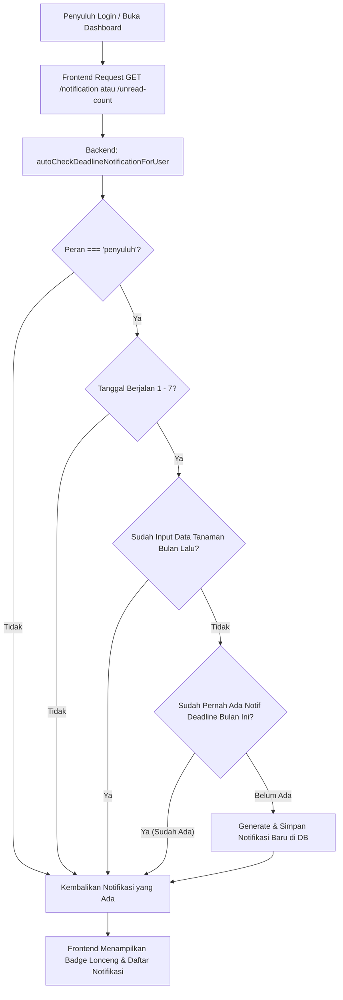

# System Design: Sistem Notifikasi Peringatan Input Data Penyuluh (Siketan)

Dokumen ini menjelaskan rancangan sistem, arsitektur, aturan bisnis, skema database, API endpoint, serta implementasi antarmuka untuk fitur **Notifikasi Peringatan Batas Waktu Input Data Tanaman** bagi peran Penyuluh pada platform Siketan.

---

## 1. Latar Belakang & Tujuan

Penyuluh Pertanian memiliki kewajiban untuk menginput laporan data tanaman setiap bulan. Terdapat kebijakan batas waktu (*deadline*) penginputan:
- **Batas Waktu Penginputan:** Tanggal **7 setiap bulan pukul 23:59 WIB** untuk data periode bulan sebelumnya.
- **Masalah:** Banyak penyuluh lupa mengisi laporan sebelum batas waktu berakhir, sehingga sistem terkunci dan data menjadi tidak lengkap.
- **Solusi:** Sistem secara otomatis mendeteksi penyuluh yang belum mengisi data pada rentang tanggal **1 hingga 7** setiap bulan dan mengirimkan notifikasi peringatan (*Deadline Warning*) pada aplikasi.

---

## 2. Arsitektur & Alur Kerja (*Workflow*)



---

## 3. Aturan Bisnis (*Business Logic*)

### A. Waktu Pemicu (*Trigger Window*)
- Notifikasi aktif diperiksa otomatis pada **tanggal 1 s/d 7 setiap bulannya**.
- Target data yang dicek adalah data **bulan sebelumnya** (misalnya: Pada tanggal 1–7 September, sistem memeriksa apakah laporan bulan Agustus sudah diinput).

### B. Mekanisme Anti-Spam (1 Notifikasi per Periode)
- Sistem **tidak akan** mengirimkan notifikasi baru berulang kali setiap hari.
- Pengecekan `existingNotif` memeriksa apakah sudah ada notifikasi bertipe `DEADLINE_WARNING` yang dibuat sejak tanggal 1 bulan berjalan.
- Jika sudah ada, sistem tidak akan menduplikasi notifikasi.

### C. Format Teks & Pesan Standar
- **Tipe Notifikasi:** `DEADLINE_WARNING`
- **Kategori:** `data_tanaman`
- **Judul:** `Peringatan Batas Waktu Input Data ([Nama Bulan Lalu])`
- **Isi Pesan:**
  > *"Anda belum menginput data tanaman untuk periode [Bulan Lalu]. Batas waktu penginputan adalah 7 [Bulan Ini] pukul 23:59 WIB. Segera lengkapi data Anda sebelum sistem mengunci input."*
- **Action URL:** `/dashboard-admin/statistik-pertanian/create` (form penginputan data statistik pertanian).

---

## 4. Skema Database

Tabel: `notifications`

| Kolom | Tipe Data | Keterangan |
| :--- | :--- | :--- |
| `id` | `INTEGER` (PK, Auto Increment) | ID Notifikasi |
| `user_id` | `INTEGER` (FK ke `tbl_akun.id`) | Penerima Notifikasi |
| `title` | `VARCHAR(255)` | Judul Notifikasi |
| `message` | `TEXT` | Isi Pesan Notifikasi Lengkap |
| `type` | `VARCHAR(50)` | `DEADLINE_WARNING`, `INFO`, dll. |
| `category` | `VARCHAR(50)` | Kategori fitur (`data_tanaman`, `info`, dll.) |
| `is_read` | `BOOLEAN` (Default: `false`) | Status keterbacaan notifikasi |
| `read_at` | `DATETIME` (Nullable) | Waktu notifikasi dibaca |
| `action_url` | `VARCHAR(255)` (Nullable) | URL navigasi saat notifikasi diklik |
| `metadata` | `JSON` (Nullable) | Data tambahan (targetMonth, targetYear, dll.) |
| `createdAt` | `DATETIME` | Waktu dibuat |
| `updatedAt` | `DATETIME` | Waktu diperbarui |

---

## 5. Spesifikasi API Endpoint

Semua endpoint dilindungi middleware autentikasi (`auth`):

### 1. Mendapatkan Daftar Notifikasi
- **Endpoint:** `GET /notification`
- **Query Params:**
  - `page` (default: 1)
  - `limit` (default: 10)
  - `is_read` (opsional: `true` / `false`)
- **Fitur Tambahan:** Otomatis memicu fungsi `autoCheckDeadlineNotificationForUser(req.user)`.

### 2. Mendapatkan Jumlah Notifikasi Belum Dibaca
- **Endpoint:** `GET /notification/unread-count`
- **Response:**
  ```json
  {
    "success": true,
    "data": {
      "unreadCount": 1
    }
  }
  ```

### 3. Menandai Notifikasi Terbaca
- **Endpoint:** `PUT /notification/:id/read`
- **Fungsi:** Mengubah `is_read` menjadi `true` dan mencatat `read_at`.

### 4. Menandai Semua Notifikasi Terbaca
- **Endpoint:** `PUT /notification/read-all`
- **Fungsi:** Menandai seluruh notifikasi user menjadi terbaca sekaligus.

### 5. Menghapus Notifikasi
- **Endpoint:** `DELETE /notification/:id`
- **Fungsi:** Menghapus satu data notifikasi milik pengguna.

---

## 6. Implementasi Antarmuka (Frontend)

### A. Dropdown Dialog Lonceng (`NotificationDropdown.tsx`)
- Terletak di bilah navigasi kanan atas (*header*).
- Menampilkan ikon lonceng dengan **badge merah beranimasi** berisi angka notifikasi yang belum dibaca.
- Saat diklik:
  - Menampilkan cuplikan notifikasi terbaru beserta waktu relatif (*"2 jam lalu"*).
  - Tombol **"Tandai semua dibaca"**.
  - Tombol di bagian bawah: **"Lihat Semua Notifikasi →"** untuk membuka halaman penuh.

### B. Halaman Khusus Semua Notifikasi (`NotificationPage.tsx`)
- **Route:** `/dashboard-admin/notifikasi`
- **Fitur Utama:**
  1. **Teks Utuh Tanpa Terpotong:** Menampilkan pesan lengkap agar pengguna dapat membaca seluruh penjelasan peringatan tanpa batasan baris.
  2. **Filter Tab:** Tab *Semua*, *Belum Dibaca*, dan *Sudah Dibaca*.
  3. **Aksi Langsung:** Tombol **"Input Sekarang →"** yang langsung mengarahkan ke form input tanaman.
  4. **Manajemen Notifikasi:** Tombol *Tandai Dibaca*, *Tandai Semua Dibaca*, dan *Hapus Notifikasi*.
  5. **Paginasi:** Navigasi halaman yang rapi jika notifikasi berjumlah banyak.

---

## 7. Panduan Testing & Pengujian

### A. Menguji Melalui Script Helper (Development)
Untuk menguji tampilan notifikasi pada akun tertentu (misalnya User ID `4514`):
```bash
# Jalankan script pengujian di folder backend
node test_notif.js
```

### B. Menguji Interaksi di Browser:
1. Login dengan akun penyuluh.
2. Cek badge lonceng di pojok kanan atas.
3. Buka dropdown dan klik notifikasi untuk memverifikasi redirect ke form penginputan data.
4. Klik **"Lihat Semua Notifikasi →"** untuk memverifikasi halaman `/dashboard-admin/notifikasi`.
5. Uji tombol **"Tandai Dibaca"** dan **"Hapus"**.
