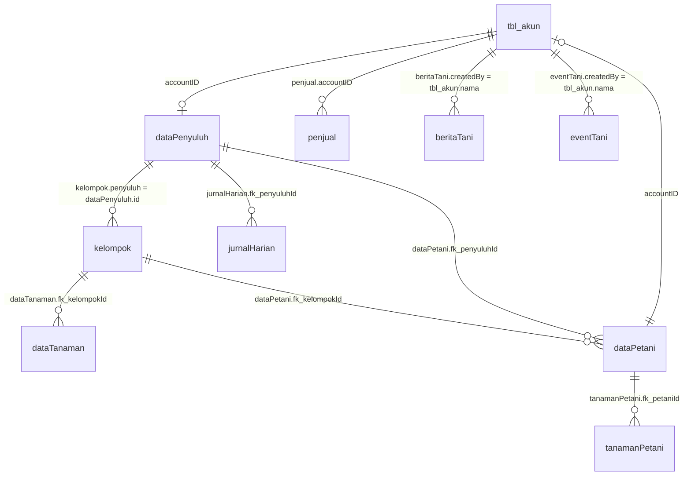

# Dokumentasi Kepemilikan Data (Data Ownership) Dashboard Penyuluh - SIKETAN

Dokumen ini menjelaskan arsitektur dan mekanisme pembatasan kepemilikan data (*data ownership & data isolation*) untuk akun **Penyuluh Pertanian** di aplikasi **SIKETAN (Sistem Informasi Ketahanan Pertanian Terpadu)**.

---

## 1. Latar Belakang & Prinsip Utama

Pada sistem SIKETAN, pengguna memiliki beberapa tingkatan peran (*roles*):
- **Operator Super Admin / Operator Admin / Operator Poktan**: Memiliki kewenangan melihat dan mengelola seluruh data secara global di wilayah Kabupaten/Dinas, termasuk data historis/legacy.
- **Penyuluh (Penyuluh Reguler & Penyuluh Swadaya)**: Merupakan petugas lapangan yang memiliki wilayah binaan dan kelompok tani (Poktan) yang dibina secara spesifik.
- **Petani**: Pengguna akhir tingkat anggota kelompok tani.

### Prinsip Pembatasan Data untuk Penyuluh:
1. **Prinsip Wilayah Binaan / Poktan Binaan (*Strict Assignment Boundary*)**:
   Penyuluh hanya berhak mengakses dan melihat data yang berada di bawah Kelompok Tani (Poktan/Gapoktan) yang secara resmi ditugaskan kepadanya. Penyuluh **tidak diperkenankan** melihat data Poktan milik penyuluh lain.
2. **Prinsip Kepemilikan Langsung (*Direct Author Ownership*)**:
   Untuk konten artikel, publikasi agenda acara, dan laporan aktivitas harian, data dibatasi pada publikasi/laporan yang dibuat oleh penyuluh itu sendiri.
3. **Prinsip Validitas Data Transaksi (*CreatedAt Integrity Filter*)**:
   - Jika pengguna yang login adalah **Penyuluh**, sistem mengecualikan data konten/transaksi yang tidak memiliki atribut `createdAt` (`createdAt IS NOT NULL`).
   - Jika pengguna yang login adalah **Operator**, seluruh data (termasuk data lama/impor sebelum sistem tracking ada) tetap dapat dilihat dan diaudit.

---

## 2. Diagram Relasi Kepemilikan Data (*Entity Relationship*)



---

## 3. Matriks Kepemilikan Data Per Halaman

| No | Modul / Halaman Dashboard | Entitas Model | Kolom Kunci Kepemilikan | Mekanisme Resolusi Kepemilikan untuk Penyuluh | Filter `createdAt` |
| :--- | :--- | :--- | :--- | :--- | :--- |
| **0** | **Dropdown / Pencarian Poktan** (`/search/poktan`) | `kelompok` | `penyuluh` | `penyuluh = String(penyuluh.id)` | Tetap tampilkan Poktan binaan (master data) |
| **1** | **Statistika Pertanian** (`dashboard-admin/statistik-pertanian`) | `dataTanaman` | `fk_kelompokId` | `fk_kelompokId IN (binaanPoktanIds)` | `createdAt IS NOT NULL` |
| **2** | **Data Tanaman** (`dashboard-admin/data-tanaman`) | `tanamanPetani` | Relasi via `dataPetani` | `dataPetani.fk_kelompokId IN (binaanPoktanIds)` ATAU `dataPetani.fk_penyuluhId = penyuluh.id` | `createdAt IS NOT NULL` |
| **3** | **Data Petani** (`/dashboard-admin/data-petani`) | `dataPetani` | `fk_kelompokId`, `fk_penyuluhId` | `fk_kelompokId IN (binaanPoktanIds)` ATAU `fk_penyuluhId = penyuluh.id` | `createdAt IS NOT NULL` |
| **4** | **Berita Pertanian** (`dashboard-admin/berita-pertanian`) | `beritaTani` | `createdBy` | `createdBy = req.user.nama` | `createdAt IS NOT NULL` |
| **5** | **Acara Pertanian** (`dashboard-admin/acara-pertanian`) | `eventTani` | `createdBy` | `createdBy = req.user.nama` | `createdAt IS NOT NULL` |
| **6** | **Daftar Toko** (`dashboard-admin/daftar-toko`) | `penjual` | `accountID` | Milik akun penyuluh (`req.user.accountID`) ATAU milik petani di bawah Poktan binaan penyuluh | `createdAt IS NOT NULL` |
| **7** | **Jurnal Penyuluh** (`dashboard-admin/jurnal-penyuluh`) | `jurnalHarian` | `fk_penyuluhId` | `fk_penyuluhId = penyuluh.id` | `createdAt IS NOT NULL` |

---

## 4. Penjelasan Detail Implementasi Tiap Halaman

### 4.0 Dropdown & Pencarian Poktan / Gapoktan (`/search/poktan`)
- **Controller**: `backend/app/controllers/users.js` (`searchPoktan`)
- **Masalah Sebelumnya**: Pada versi terdahulu, pencarian menambahkan fallback wilayah `desaBinaan` dan `kecamatanBinaan` dengan operator `OR`. Hal ini mengakibatkan seluruh kelompok tani di satu kecamatan muncul (misal 68 Poktan), termasuk Poktan yang dipegang oleh penyuluh lain.
- **Penyelesaian**: Fallback wilayah dihapus untuk akun Penyuluh. Pencarian secara ketat dibatasi ke:
  ```javascript
  where: {
    [Op.or]: [
      { penyuluh: String(penyuluhData.id) },
      { penyuluh: Number(penyuluhData.id) }
    ]
  }
  ```
- **Dampak**: Dropdown dan autocomplete Gapoktan/Poktan di seluruh formulir dashboard hanya menampilkan kelompok tani yang secara sah dipegang oleh penyuluh yang sedang login.

---

### 4.1 Statistika Pertanian (`dashboard-admin/statistik-pertanian`)
- **Endpoint**: `GET /statistik`
- **Controller**: `backend/app/controllers/dataTanaman.js` (`getAllDataTanaman`)
- **Aturan**:
  - `dataTanamans` tidak memiliki kolom `fk_penyuluhId` langsung, melainkan terikat pada kelompok tani melalui `fk_kelompokId`.
  - Sistem mengumpulkan seluruh ID kelompok binaan penyuluh (`binaanIds`).
  - Query otomatis menerapkan batasan:
    ```javascript
    whereClause.fk_kelompokId = { [Op.in]: binaanIds };
    whereClause.createdAt = { [Op.not]: null };
    ```
  - Jika penyuluh memfilter dropdown kelompok tertentu, sistem memvalidasi bahwa kelompok yang dipilih harus merupakan bagian dari `binaanIds`.

---

### 4.2 Data Tanaman Petani (`dashboard-admin/data-tanaman`)
- **Endpoint**: `GET /list-tanaman`
- **Controller**: `backend/app/controllers/tanamanPetani.js` (`getAllTanamanPetani`)
- **Aturan**:
  - `tanamanPetanis` memiliki relasi `fk_petaniId` ke tabel `dataPetanis`.
  - Penyuluh hanya dapat melihat komoditas tanaman milik petani yang:
    1. Terdaftar di salah satu Poktan binaannya (`dataPetani.fk_kelompokId IN (binaanIds)`), ATAU
    2. Ditugaskan langsung ke penyuluh tersebut (`dataPetani.fk_penyuluhId = penyuluhData.id`).
  - Join dilakukan dengan `required: true` ketika pengguna adalah Penyuluh agar komoditas petani liar/luar wilayah tidak dapat diakses.
  - Ditambahkan filter `createdAt: { [Op.not]: null }`.

---

### 4.3 Data Petani (`/dashboard-admin/data-petani`)
- **Endpoint**: `GET /daftar-tani`
- **Controller**: `backend/app/controllers/dataTani.js` (`daftarTani`)
- **Aturan**:
  - Setiap record petani di `dataPetanis` memiliki `fk_kelompokId` dan `fk_penyuluhId`.
  - Filter untuk Penyuluh:
    ```javascript
    whereConditions.push({
      [Op.or]: [
        { fk_kelompokId: { [Op.in]: binaanIds } },
        { fk_penyuluhId: penyuluhData.id }
      ]
    });
    whereConditions.push({ createdAt: { [Op.not]: null } });
    ```
  - Petani dari poktan lain tidak akan muncul pada daftar maupun pencarian penyuluh.

---

### 4.4 Berita Pertanian (`dashboard-admin/berita-pertanian`)
- **Endpoint**: `GET /info-tani`
- **Controller**: `backend/app/controllers/InfoTani.js` (`infoTani`)
- **Router**: `backend/app/router/InfoTani.js` (dipasangi middleware `optionalAuth`)
- **Aturan**:
  - Tabel `beritatanis` menyimpan nama penulis di kolom `createdBy`.
  - Saat penyuluh login ke dashboard, filter menambahkan `createdBy: req.user.nama` dan `createdAt: { [Op.not]: null }`.
  - Penyuluh hanya dapat mengelola dan melihat berita yang ditulis oleh dirinya sendiri.

---

### 4.5 Acara Pertanian (`dashboard-admin/acara-pertanian`)
- **Endpoint**: `GET /event-tani`
- **Controller**: `backend/app/controllers/InfoTani.js` (`eventTani`)
- **Router**: `backend/app/router/InfoTani.js` (dipasangi middleware `optionalAuth`)
- **Aturan**:
  - Tabel `eventtanis` menyimpan nama penyelenggara di kolom `createdBy`.
  - Saat penyuluh login, query memfilter `createdBy: req.user.nama` dan `createdAt: { [Op.not]: null }`.
  - Mencegah penyuluh mengedit atau menghapus acara penyuluh/instansi lain.

---

### 4.6 Daftar Toko Pertanian (`dashboard-admin/daftar-toko`)
- **Endpoint**: `GET /product-petani-no-auth` / `/product-petani`
- **Controller**: `backend/app/controllers/tokoTani.js` (`productPetani`)
- **Router**: `backend/app/router/tokoTani.js` (dipasangi middleware `optionalAuth`)
- **Aturan**:
  - Tabel `penjuals` terhubung ke `tbl_akun` via `accountID`.
  - Pada dashboard penyuluh, produk yang ditampilkan dibatasi pada:
    1. Produk milik penyuluh itu sendiri (`accountID = req.user.accountID`).
    2. Produk milik petani binaannya (`accountID IN (petaniBinaanAccountIds)`).
  - Ditambahkan filter `createdAt: { [Op.not]: null }`.

---

### 4.7 Jurnal Penyuluh (`dashboard-admin/jurnal-penyuluh`)
- **Endpoint**: `GET /jurnal-kegiatan`
- **Controller**: `backend/app/controllers/dataPenyuluh.js` (`jurnalKegiatan`)
- **Aturan**:
  - Tabel `jurnalharians` memiliki foreign key langsung `fk_penyuluhId` ke tabel `dataPenyuluhs`.
  - Ketika penyuluh login, sistem menyaring secara tegas:
    ```javascript
    whereClause.fk_penyuluhId = penyuluhData.id;
    whereClause.createdAt = { [Op.not]: null };
    ```
  - Kerahasiaan catatan aktivitas harian masing-masing penyuluh terisolasi penuh.

---

## 5. Modul Helper Terpusat (`penyuluhHelper.js`)

Untuk menjaga konsistensi dan mencegah duplikasi logika resolusi identitas penyuluh, sistem menyediakan modul pembantu di:
📁 [`backend/helpers/penyuluhHelper.js`](file:///d:/Project/Real%20Project/Siketan/Production/siketan-production/backend/helpers/penyuluhHelper.js)

### Fungsi yang Disediakan:
1. `isPenyuluhUser(user)`:
   Mendeteksi apakah user memiliki peran penyuluh berdasarkan `user.peran` atau `user.role.name` (`penyuluh`, `penyuluh_reguler`, `penyuluh_swadaya`).
2. `getPenyuluhRecord(user)`:
   Mencari data profil penyuluh di tabel `dataPenyuluhs` menggunakan `accountID`, `id`, `email`, `nik`, atau `nama`.
3. `getAssignedPoktanIds(penyuluhId)`:
   Mengembalikan array `[id, id, ...]` kelompok tani yang kolom `penyuluh`-nya sama dengan `penyuluhId`.

---

## 6. Prosedur Audit & Pengujian Data Ownership

Untuk memastikan integritas pembatasan data tidak bocor di kemudian hari, dapat dijalankan pengujian otomatis menggunakan script node runner terhadap controller:
1. **Simulasi Akun Penyuluh**: Request dikirim dengan payload token penyuluh tertentu. Output dicek apakah seluruh `id`, `fk_kelompokId`, atau `createdBy` 100% konsisten dengan data penyuluh tersebut.
2. **Simulasi Akun Operator**: Request dikirim dengan payload token operator. Output diverifikasi dapat melihat seluruh agregasi data tanpa terpotong.
