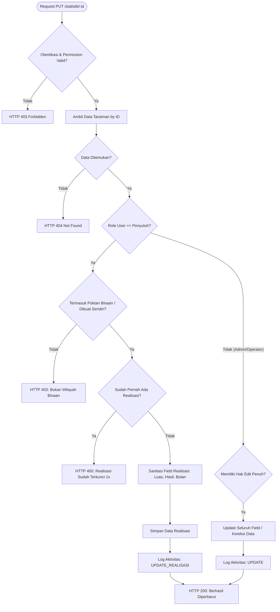

# Sistem Desain & Aturan Bisnis: Update Realisasi Panen (Statistika Pertanian)

Dokumen ini menjelaskan secara menyeluruh rancangan sistem, arsitektur keamanan, aturan bisnis, matriks otorisasi per peran (*role*), spesifikasi endpoint backend, serta perilaku antarmuka (*UI/UX*) untuk fitur **Input & Update Realisasi Panen** pada platform **Siketan**.

---

## 1. Latar Belakang & Tujuan

Pada siklus pelaporan statistika pertanian di Siketan:
1. **Fase Awal (Prakiraan Tanam):** Data awal dimasukkan berupa kategori komoditas, luas lahan tanam, serta prakiraan luas panen, prakiraan hasil panen (ton), dan prakiraan bulan panen.
2. **Fase Panen (Realisasi):** Ketika panen tiba, data riil hasil pertanian wajib dilaporkan ke sistem, meliputi **Luas Realisasi Panen (HA)**, **Hasil Realisasi Panen (TON)**, dan **Bulan Realisasi Panen**.

**Tujuan Fitur:**
- Memberikan akses kepada peran **Penyuluh** (Penyuluh Pusat/Reguler dan Penyuluh Swadaya) agar dapat menginput data realisasi panen secara mandiri satu per satu langsung dari tabel data statistika pertanian.
- Menjaga integritas dan keabsahan data dari manipulasi (*anti-fraud* & *data consistency*) dengan menerapkan batasan **input 1 kali** untuk Penyuluh, isolasi wilayah binaan (*multi-tenant poktan*), serta memberikan hak koreksi khusus kepada **Operator** dan **Admin**.

---

## 2. Matriks Hak Akses & Otorisasi Berdasarkan Peran

| Role (*Peran*) | Permission Code | Hak Akses Input Realisasi | Hak Akses Edit/Koreksi Realisasi | Batasan Wilayah | Batasan Frekuensi Input |
|:---|:---|:---:|:---:|:---|:---|
| **Operator Super Admin** | `statistic_edit`, `statistic_realisasi` | ✅ Ya | ✅ Ya (Penuh) | Seluruh Kabupaten/Kota | Tidak Terbatas |
| **Operator Admin** | `statistic_edit`, `statistic_realisasi` | ✅ Ya | ✅ Ya (Penuh) | Seluruh Kabupaten/Kota | Tidak Terbatas |
| **Operator Poktan** | `statistic_edit`, `statistic_realisasi` | ✅ Ya | ✅ Ya (Kelompok Tani terkait) | Khusus Poktan terdaftar | Tidak Terbatas |
| **Penyuluh (Pusat / Reguler)** | `statistic_realisasi` | ✅ Ya | ❌ Tidak (Terkunci setelah 1x input) | Khusus Poktan Binaan (`binaanIds`) / Data Sendiri | **Hanya 1 Kali** |
| **Penyuluh Swadaya** | `statistic_realisasi` | ✅ Ya | ❌ Tidak (Terkunci setelah 1x input) | Khusus Poktan Binaan (`binaanIds`) / Data Sendiri | **Hanya 1 Kali** |
| **Petani** | *(Tidak ada)* | ❌ Tidak | ❌ Tidak | - | - |

---

## 3. Aturan Bisnis (Business Rules)

### A. Aturan 1x Input Realisasi untuk Penyuluh (*One-Time Submission Rule*)
- Akun Penyuluh hanya diperbolehkan menginput data realisasi **sebanyak 1 kali** untuk setiap baris data tanaman.
- Jika data realisasi sudah pernah diisi (nilai `realisasiLuasPanen`, `realisasiHasilPanen`, atau `realisasiBulanPanen` bukan `null` / bukan kosong), data tersebut otomatis **terkunci permanen** bagi akun Penyuluh.
- **Mekanisme Koreksi Kesalahan Data:** Jika Penyuluh salah memasukkan angka realisasi, Penyuluh **wajib berkoordinasi dengan Operator Poktan atau Operator Admin** untuk melakukan pembetulan data.

### B. Isolasi Data & Wilayah Binaan (*Data Ownership & BOLA Prevention*)
- Penyuluh **hanya dapat mengakses dan mengupdate** data tanaman yang:
  1. `fk_kelompokId` terdaftar sebagai salah satu kelompok tani binaan penyuluh tersebut (berdasarkan relasi `dataPenyuluh.id` dengan kolom `kelompok.penyuluh`).
  2. ATAU data tanaman yang kolom `created_by`-nya sama dengan `req.user.id`.
- Request dari Penyuluh untuk data di luar wilayah binaannya akan langsung ditolak oleh backend dengan status **HTTP 403 Forbidden**.

### C. Pencegahan Manipulasi Data Dasar (*Mass Assignment Prevention*)
- Pada request update dari Penyuluh, backend menerapkan *whitelist sanitization* ketat:
  - **Field yang boleh diperbarui:** `realisasiLuasPanen`, `realisasiHasilPanen`, `realisasiBulanPanen`.
  - **Field data awal yang diabaikan/dikunci:** `kategori`, `komoditas`, `periodeTanam`, `luasLahan`, `prakiraanLuasPanen`, `prakiraanHasilPanen`, `prakiraanBulanPanen`, `fk_kelompokId`.
- Operator/Admin tetap memiliki hak penuh (*full edit*) untuk mengubah seluruh field data awal jika diperlukan.

### D. Validasi Nilai Realisasi
- `realisasiLuasPanen`: Wajib berupa angka non-negatif (`>= 0`), mendukung desimal (contoh: `12.50` HA).
- `realisasiHasilPanen`: Wajib berupa angka non-negatif (`>= 0`), mendukung desimal (contoh: `45.75` TON).
- `realisasiBulanPanen`: Wajib berupa salah satu dari 12 nama bulan baku (`Januari` s.d. `Desember`).

---

## 4. Perilaku Antarmuka (UI/UX Specification)

### A. Tabel Utama Statistika Pertanian (`DashboardStatistika.tsx`)

| Kondisi Data | Akun Penyuluh | Akun Operator / Admin |
|:---|:---|:---|
| **Belum Ada Realisasi** (`realisasi === null`) | Tampil icon **Realisasi (lingkaran centang ungu)** aktif. Mengarahkan ke form input realisasi. | Tampil icon Realisasi + Edit + Detail + Hapus. |
| **Sudah Ada Realisasi** (`realisasi !== null`) | Icon Realisasi **DISEMBUNYIKAN (HIDE)**. Hanya tampil icon Lihat Detail (mata hijau). | Icon Realisasi tetap tampil (untuk keperluan edit/koreksi) bersama icon Edit & Detail. |

### B. Halaman Form Realisasi Panen (`RealisasiStatstika.tsx`)
- **Akses Normal (Belum Terisi):** Menampilkan ringkasan data prakiraan di kolom kiri, dan form isian realisasi di kolom kanan.
- **Akses Langsung via URL pada Data yang Sudah Terisi (Role Penyuluh):**
  - Muncul banner peringatan berwarna kuning (*amber alert box*):
    > *"⚠️ Akses Terkunci: Data realisasi untuk tanaman ini sudah pernah diinput. Akun Penyuluh hanya dapat menginput realisasi 1 kali. Jika terdapat kesalahan data, silakan hubungi Operator/Admin untuk memperbaikinya."*
  - Seluruh field input (`Input Luas`, `Input Hasil`, `Select Bulan`) dalam keadaan **disabled / tidak dapat diedit**.
  - Tombol simpan berlabel **"Realisasi Sudah Diinput (Terkunci)"** dan dalam keadaan **disabled**.

### C. Halaman Detail Data Statistika (`DetailStatistika.tsx`)
- Jika data belum direalisasi, tombol **"Input Realisasi"** muncul di header dan card Aksi Cepat.
- Jika data sudah direalisasi, tombol **"Input Realisasi"** disembunyikan untuk role Penyuluh.

---

## 5. Spesifikasi Teknis Backend

### A. Route Definition & Otorisasi
- **Endpoint:** `PUT /api/v1/statistik/:id`
- **Middleware:** `auth`, `hasAnyPermission([PERMISSIONS.STATISTIC_EDIT, PERMISSIONS.STATISTIC_REALISASI])`
- **File:** [statistik.js](file:///d:/Project/Real%20Project/Siketan/Production/siketan-production/backend/app/router/statistik.js)

### B. Alur Logika Controller (`editDataTanaman`)

### C. Error Handling & Response Code

| Status Code | Kondisi | Contoh Pesan Response |
|:---|:---|:---|
| **200 OK** | Realisasi berhasil disimpan | `{"message": "Data realisasi panen berhasil diperbarui.", "data": {...}}` |
| **400 Bad Request** | Realisasi sudah pernah diinput oleh penyuluh | `{"message": "Data realisasi untuk tanaman ini sudah pernah diinput. Penyuluh hanya dapat menginput realisasi 1 kali. Jika terdapat kesalahan data, silakan hubungi Operator/Admin untuk memperbaikinya."}` |
| **400 Bad Request** | Nilai input tidak valid (misal: negatif / format bulan salah) | `{"message": "Realisasi luas panen harus berupa angka positif."}` |
| **403 Forbidden** | Penyuluh mengakses kelompok tani di luar binaan | `{"message": "Anda tidak memiliki akses untuk mengubah data pada kelompok tani ini."}` |
| **404 Not Found** | ID data tanaman tidak ditemukan | `{"message": "Data tanaman tidak ditemukan."}` |

---

## 6. Audit Trail & Logging

Setiap kali data realisasi berhasil disimpan oleh Penyuluh, sistem secara otomatis mencatat riwayat aktivitas pengguna:
- **Tabel:** `log_activities`
- **User ID:** `req.user.id`
- **Activity:** `UPDATE_REALISASI`
- **Type:** `DATA TANAMAN`
- **Detail ID:** `dataTanaman.id`

Hal ini memastikan semua tindakan pengisian realisasi dapat diaudit secara transparan oleh Administrator.
